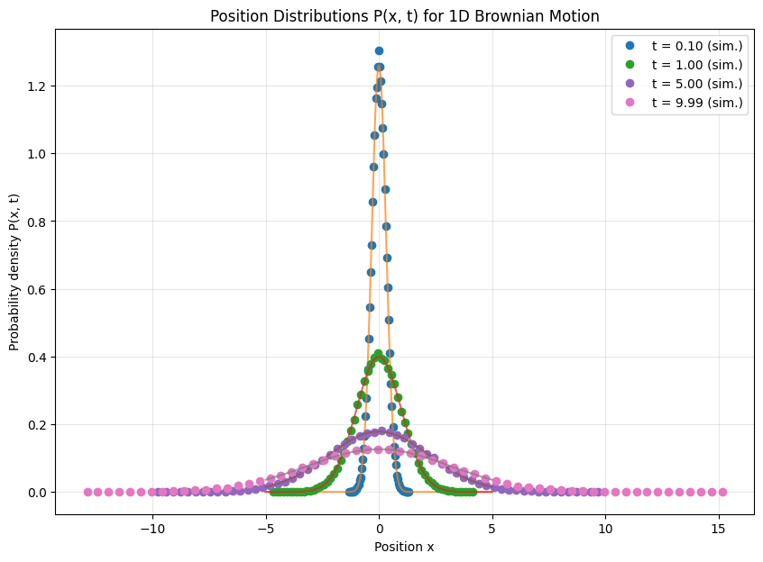
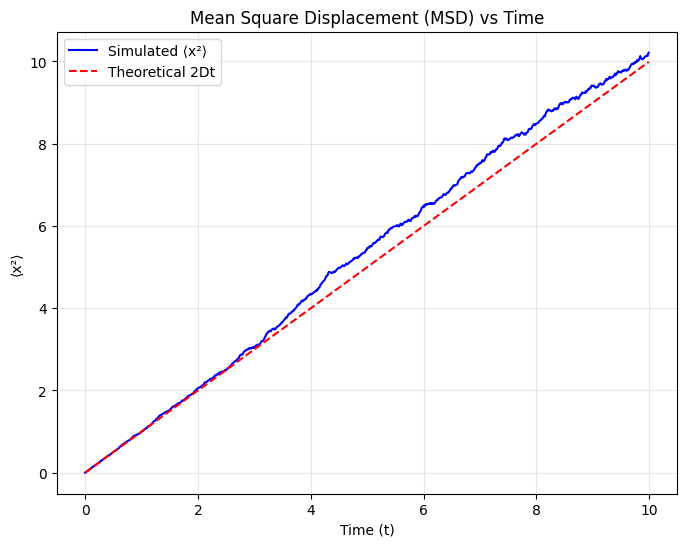

# 🚶‍♂️ 1D Brownian Motion Simulation

A **numerical simulation of one-dimensional Brownian motion**, illustrating how the random motion of particles leads to **diffusive behavior** over time.  
This folder contains two complementary Python scripts:

1. **`1D_Brownian_Motion_Distribution.ipynb`** — demonstrates the **statistical properties of random displacements**, showing that particle motion follows a Gaussian distribution.  
2. **`1D_Brownian_Motion.ipynb`** — simulates **time evolution** of particles undergoing Brownian motion and verifies **Einstein’s diffusion law**.

---

## ⚙️ Features

- 🎲 **Random step generation:** Gaussian-distributed displacements Δx ~ 𝒩(0, σ²)  
- 🧮 **Mean square displacement (MSD):** ⟨x²(t)⟩ ∝ t  
- 📈 **Diffusion coefficient extraction:** linear regression on MSD vs time  
- 🎨 **High-quality plots:** particle trajectories and statistical distributions  
- 🧩 **Two parts:**
  - *Part I — Random step distribution*: visualizes the Gaussian nature of particle displacements  
  - *Part II — Brownian dynamics*: tracks multiple particles and averages their diffusion

---

## 🧠 Background

In **one dimension**, Brownian motion can be modeled as a sequence of independent random steps:

$$
x(t + \Delta t) = x(t) + \Delta x,
$$

where each displacement $\Delta x$ is drawn from a **normal distribution** with zero mean and variance related to the **diffusion coefficient (D)**:

$$
\langle (\Delta x)^2 \rangle = 2 D \, \Delta t.
$$

Averaging over many particles (or realizations) gives the **mean square displacement (MSD)**:

$$
\langle x^2(t) \rangle = 2 D t.
$$

This linear dependence of MSD on time is a fundamental prediction of **Einstein’s 1905 theory** of Brownian motion.

---

## 📊 Example Outputs

### 🔹 Random Step Distribution

Histogram of displacements $\Delta x$ showing Gaussian statistics centered at zero.

---

### 🔹 Brownian Trajectories and Diffusion Law

Random trajectories of particles undergoing 1D Brownian motion.  
The inset (or accompanying plot) shows $\langle x^2 \rangle$ vs time, demonstrating a linear relationship consistent with Einstein’s diffusion law.

---

