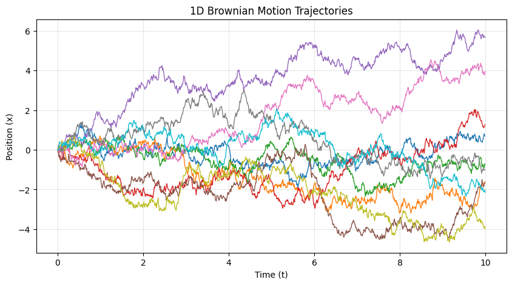
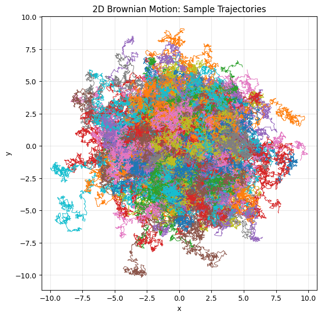

# ☕ Brownian Motion Simulation

A **computational study of Brownian motion** — the random motion of microscopic particles suspended in a fluid, as first explained by **Albert Einstein (1905)**.  

This project simulates and analyzes **1D** and **2D Brownian motion**, visualizing particle trajectories and verifying **Einstein’s diffusion law** through numerical experiments.

---

## ⚙️ Features

- 🧮 **1D and 2D Brownian motion models** implemented with random Gaussian steps  
- 💡 **Einstein’s diffusion law:**  
  ⟨x²(t)⟩ = 2 D t (1D) and ⟨r²(t)⟩ = 4 D t (2D)  
- 📊 **Mean square displacement analysis** — verifies the linear dependence on time  
- 🎨 **Trajectory visualization** for multiple particles  
- 🔬 **Statistical averaging** over thousands of random walkers  
- 📁 **Organized structure:**  
  - `/1-D Brownian Motion` → Single-axis Brownian motion  
  - `/2-D Brownian Motion` → Planar Brownian motion  
  - `/figures` → Generated plots and visualizations  

---

## 🧠 Background

Brownian motion was first observed by **Robert Brown (1827)** and later given a quantitative explanation by **Albert Einstein (1905)**.  
Einstein demonstrated that the **random motion** of microscopic particles arises from **collisions with fluid molecules**, leading to a measurable **diffusion coefficient (D)**.

The key relation connecting microscopic motion to macroscopic diffusion is:

$$
\langle x^2(t) \rangle = 2 D t \quad \text{(1D)}, \qquad 
\langle r^2(t) \rangle = 4 D t \quad \text{(2D)}
$$

where:
- ⟨x²(t)⟩ or ⟨r²(t)⟩ is the **mean square displacement**,  
- D is the **diffusion coefficient**,  
- t is the **elapsed time**.

This relationship is a cornerstone in **statistical physics**, **thermodynamics**, and **stochastic processes**, providing one of the earliest empirical confirmations of the **atomic nature of matter**.

---

## 📊 Example Outputs

### 🔹 1D Brownian Motion

Sample trajectories of particles moving along one axis.  
The mean square displacement ⟨x²⟩ increases linearly with time, as predicted by Einstein’s diffusion law.

---

### 🔹 2D Brownian Motion

Random trajectories of particles in two dimensions.  
The simulation verifies ⟨r²⟩ = 4 D t, illustrating isotropic diffusion in the plane.

---

This project is released under the [MIT License](LICENSE).
